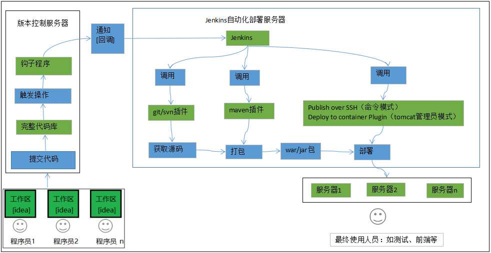
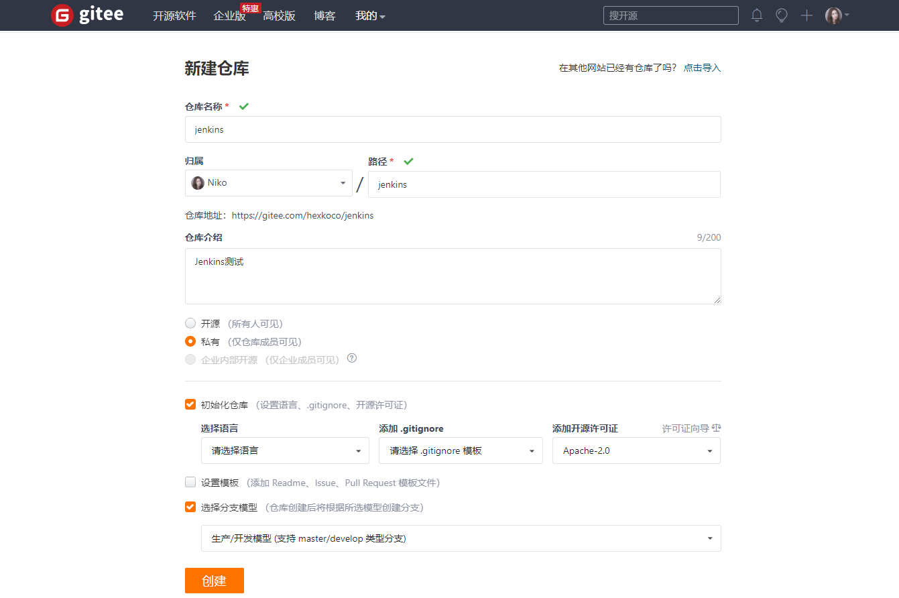
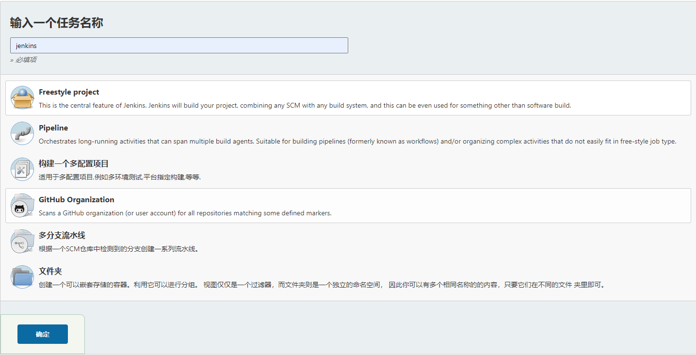
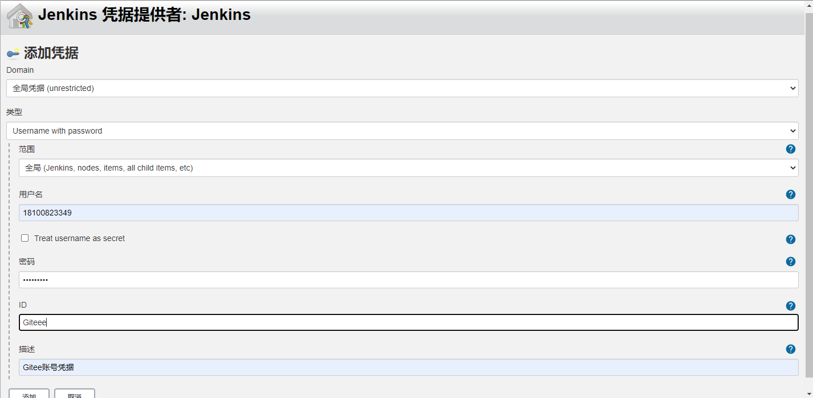
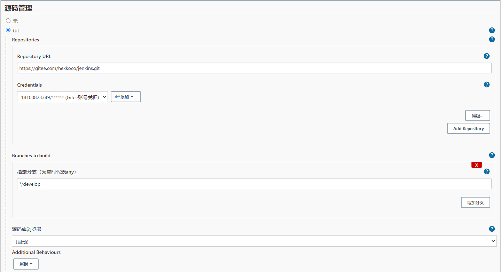
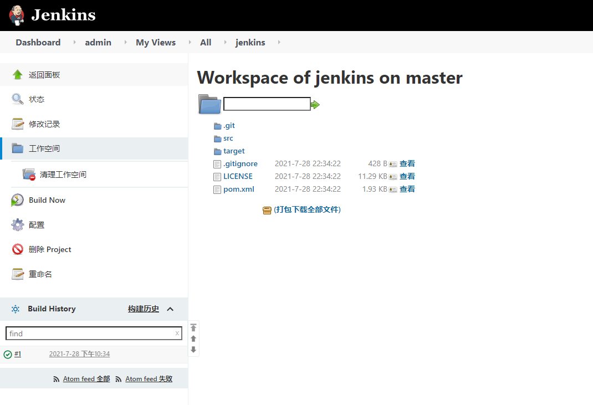
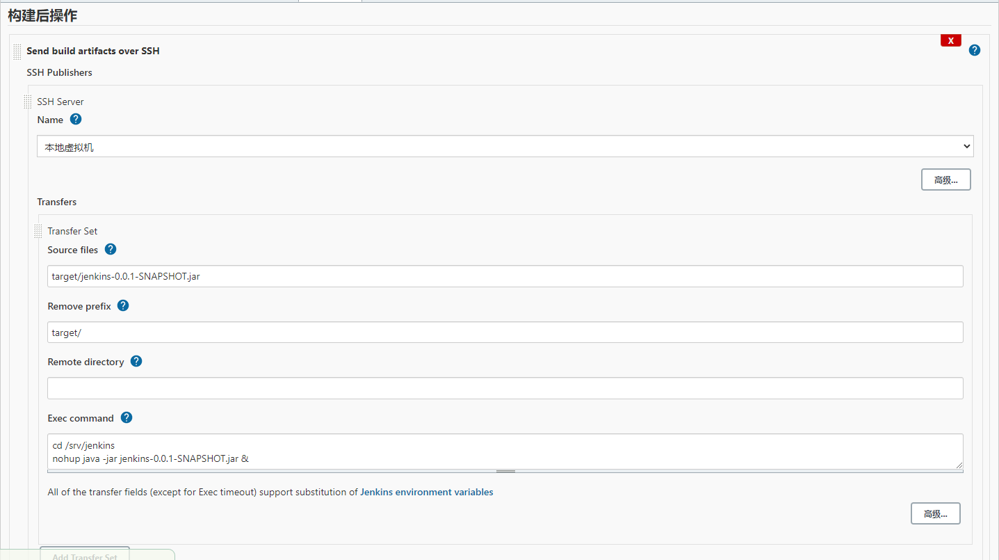
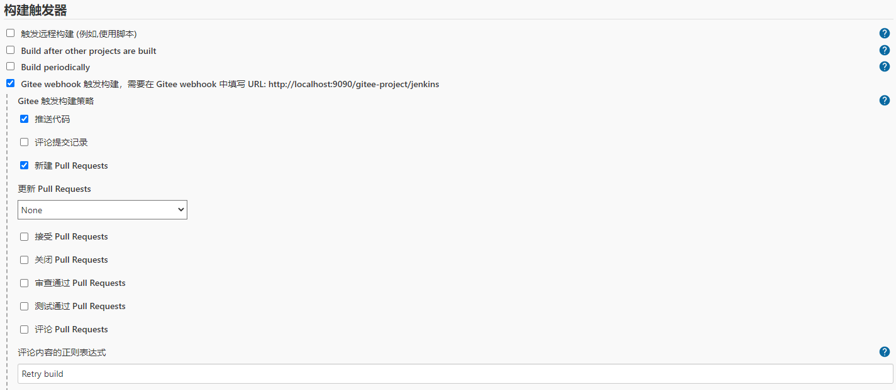

:artificial_satellite: **Jenkins**

---

#### 1.项目的效率优化

项目开发过程中的几个效率优化方式：

1. **持续部署**

   解决问题：开发过程中进行单元测试能够通过，但是部署到服务器上运行出现问题。

   关注点：仅仅单元测试还不够，各个模块都必须能够在服务器上运行。<u>持续地对代码修改进行部署</u>，为下一步测试环节或最终用户的正式使用做好准备。

2. **持续集成**

   解决问题：各个小组分别负责各个具体模块开发，各个模块独立测试虽然能够通过，但是上线前将所有模块整合到一起集成测试却发现很多问题。

   关注点：<u>经常性、频繁的把所有模块集成在一起进行测试</u>，尽早发现项目整体运行问题，尽早解决。

3. **持续交付**

   解决问题：项目的各个升级版本之间间隔时间太长，对用户反馈感知迟钝，无法精确改善用户体验，用户流失严重。

   关注点：<u>用小版本不断进行快速迭代，不断收集用户反馈信息，用最快的速度改进优化</u>，使研发团队的最新代码能够尽快让最终用户体验到。

项目效率优化的目标：

1. 降低风险
   一天中进行多次的集成，并做了相应的测试，这样有利于检查缺陷，了解软件的健康状况，减少假定。

2. 减少重复过程
   产生重复过程有两个方面的原因：

   - 第一个是编译、测试、打包、部署等等固定操作都必须要做，无法省略任何一个环节；
   - 另一个是一个缺陷如果没有及时发现，有可能导致后续代码的开发方向是错误的，要修复问题需要重新编写受影响的所有代码。

   使用 Jenkins 等持续集成工具既可以把构建环节从手动完成转换为自动化完成，又可以通过增加集成频次尽早发现缺陷避免方向性错误。

3. 任何时间、任何地点生成可部署的软件
   持续集成可以让您在任何时间发布可以部署的软件。从外界来看，这是持续集成最明显的好处。利用持续集成，您可以经常对源代码进行一些小改动，并将这些改动和其他的代码进行集成。如果集成出现问题，项目成员马上就会被通知到，问题会第一时间被修复。

4. 增强项目的可见性
   持续集成让我们能够注意到趋势并进行有效的决策，它带来了两点积极效果：

   - 有效决策：持续集成系统为项目构建状态和品质指标提供了及时的信息，有些持续集成系统可以报告功能完成度和缺陷率。
   - 注意到趋势：由于经常集成，我们可以看到一些趋势，如构建成功或失败、总体品质以及其它的项目信息。

5. 建立团队对开发产品的信心
   持续集成可以建立开发团队对开发产品的信心，因为他们清楚的知道每一次构建的结果，他们知道他们对软件的改动造成了哪些影响，结果怎么样。

持续集成工具 **Jenkins** 和 **Hudson**

Jenkins 起源于 Hudson。Hudson 在商业软件的路上继续前行，而 Jenkins 则作为开源软件，从 Hudson 分支出来。

所以 Jenkins 和 Hudson 是两款非常相似的产品，它们都可以整合 GitHub 或 Subversion 进行使用。

传统部署和持续集成方式对比：

1. 传统部署方式

   

   

   传统部署方式过程较为简单，但每一步都需要开发人员手动操作，如果代码频繁改变，会显著地增加工作量。

2. 持续集成方式

   

   

   

   使用持续集成方式的具体体现：<u>向版本库提交新的代码后，应用服务器上自动部署，用户或测试人员使用的马上就是最新的应用程序</u>。

---

#### 2.持续集成环境搭建

Jenkins 可以与 SVN 和 Git 进行集成，下面将采用 Jenkins + Git 进行持续集成环境搭建。

1. 开发环境（Windows）安装 Git、Maven。

2. 开发环境（Windows）安装 Jenkins：

   安装包下载地址：https://www.jenkins.io/zh/download/，官网提供了 war、Docker、CentOS、Windows 等版本的软件包，需要我们选择开发环境对于的系统版本进行下载（以 Windows 为例）。

   在 Windows 系统中，下载完 .mis 安装包后进行打开，进入 Jenkins 安装向导，根据提示完成安装，也可以在 https://www.jenkins.io/doc/book/installing/windows/ 查看安装文档。

   安装完成后，在 http://localhost:9090 地址进行访问。

3. 根据页面提示进行 Jenkins 初始化

   - 输入密码进入 Jenkins。

   - 选择「安装推荐的插件」进行必要的插件安装。

     

   - 部分插件可能安装失败，这是由于国外的官方镜像源不稳定或不可用，可以尝试一下解决方法：

     1. 在 Jenkins 官网搜索 https://plugins.jenkins.io/ 下载想要的插件导入到 Jenkins 中。

        - 在主界面选择「Manage Jenkins」 -> 「Manage Plugins」 -> 「高级」，然后在此页面上传插件。
        - 在地址栏输入 http://localhost:9090/pluginManager/advanced 进入到该页面上传插件。

     2. 更换镜像源然后重启 Jenkins

        - 在 http://mirrors.jenkins-ci.org/status.html 查看 Jenkins 支持的镜像源。
        - 选择 cn 地区的镜像地址并复制。
        - 进入 http://localhost:9090/pluginManager/advanced 页面将镜像源地址粘贴到「升级地址」的位置。
        - 输入地址 http://localhost:9090/restart 进行重启。

        重启 Jenkins 后，之前安装失败的插件会自动安装，可以在 http://localhost:9090/pluginManager/installed 页面进行查看。
   
4. 管理 Jenkins 配置

   进入「Manage Jenkins」进行一些基本的 Jenkins 配置。

   - 全局工具配置「Global Tool Configuration」

     1. 配置 Maven 的 settings.xml 地址。

        

     2. 配置 JDK（需要去掉 Install automatacally 选项输入 JAVA_HOME）

        

     3. 配置 Git 名称。

     4. 配置 Maven（需要去掉 Install automatacally 选项输入 MAVEN_HOME）

        

   

:1st_place_medal: 以上配置完成后，即可搭建项目创建 Jenkins 任务。

---

#### 3.Jenkins工作创建

创建一个 SpringBoot Web 项目用于测试：

- 使用 Gitee 创建项目仓库：

  

  

  

- 复制仓库地址，在 Idea 中 Clone 该项目。

- 在项目中创建一个 SpringBoot Web 项目，创建 demo controller 并进行初始化提交。

- 项目 demo url 接口测试无误后进行 Jenkins 工作创建。

Jenkins 工作任务创建：

1. 创建 Jenkins 工作任务

   - 「首页」 -> 「新建Item」/「Create a job」 -> 输入任务名称 -> 「Freestyle project」 -> 点击确定。

     

   - 添加项目描述。

   - 源码管理模块选择 Git，在「Repository URL」栏位输入仓库 **https** 地址。

   - 添加凭证（Gitee 的账户和密码）

     

   - 指定需要构建的分支名称：

     

   - 在「构建环境」模块增加构建步骤，选择「Invoke top-level Marven targets」输入 Maven 版本和执行目标（clean install）

     

   - 保存任务。

   - 在任务页面中点击「Build Now」进行构建（可以点击「控制台输出」查看构建过程及错误信息）。

   - 构建完成后，可以在「工作空间」查看工作区文件。

     

   

---

#### 4.Jenkins自动发布

> :zap: 在添加自动发布功能前，请确保 Jenkins 安装了以下插件：
>
> - SSH plugin
> - SSH Build Agents plugin
> - Publish Over SSH
> - Git plugin
> - Deploy to container Plugin
> - Command Agent Launcher Plugin
> - bouncycastle API Plugin

Jenkins 自动发布构建：

1. 点击「Manage Jenkins」 -> 「Configure System」添加 SSH Server：

   

   注意：需要勾选「Use password authentication, or use a different key」然后在「Passphrase / Password」栏位中输入虚拟机用户登录的密码，点击「Test Configuration」显示成功即可。

2. 配置项目 SSH 信息，添加构建后操作选择「Send build artifacts over SSH」进行配置：

   

   > :biking_man: 注意：需要点击「高级」选项勾选 **Exec in pty**（虚拟终端），否则执行 nohup 命令后不能正常退出命令，导致 **UNSTABLE** 的构建结果，日志信息也不能正常输出。

3. <u>脚本执行后，服务进程自动被 kill 问题的解决</u>

   为了可靠地杀死在构建过程中由作业产生的进程，Jenkins 会将构建过程中产生的其他进程进行 kill。

   在发布 jar 时，构建后执行`nohup java -jar xxx.jar &`进入服务器查看，java 进程并未运行，日志文件也没有产生。

   - 解决方法 1：执行命令后执行 sleep

     ~~~shell
     nohup java -jar xxx.jar & sleep 1
     ~~~

   - 解决方法 2：使用双层的 nohup 启动服务

     首先，在服务器上新建服务的启动脚本，脚本中使用 nohup 进行服务启动：`nohup java -jar xxx.jar &`

     然后在 jenkins 的「Exec command」中使用 nohup 运行脚本：`nohup ./xxx.sh`。

     注意：「Exec command」中不能再添加 & 符号，否则进程仍然会被 kill。

至此，Jenkins 构建成功后将会自动将程序发布至服务器上。

---

#### 5.Jenkins+Gitee配置WebHook

Jenkins 与 Gitee 的集成文档可以参考：https://gitee.com/help/articles/4193

> :athletic_shoe: 使用 Gitee WebHook 之前，需要先在 Jenkins 插件中心安装 Gitee 插件。

然后需要点击「Manage Jenkins」 -> 「Configure System」配置 Gitee：

> 配置 Gitee 时需要添加 Gitee APIV5 私人令牌，具体教程可参考链接：https://gitee.com/help/articles/4193

Gitee 配置完成后，在项目配置中添加 WebHook 信息：

选择 Gitee webhook 触发构建，此时会给出 WebHook 的 url：http://localhost:9090/gitee-project/jenkins

> :rabbit2: 由于 Gitee 是在公网中，无法访问到本地的 Jenkins 服务器，需要先将内网端口映射到外网。
>
> 使用 ngrok 工具将内网端口映射到外网：https://ngrok.com/download
>
> 下载解压后运行 ngrok.exe 程序，执行命令 ngrok.exe http 9090 即可将内网 9090 端口映射至外网。
>
> 
>
> 如图：访问 http://6d98e99e6d7b.ngrok.io 即可访问到 http://localhost:9090 。

Jenkins 触发器构建完成后，在 Gitee 的仓库设置中添加 WebHook 即可。